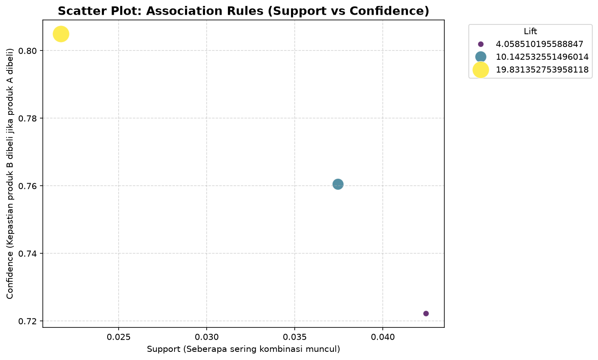

# Market Basket Analysis — Produk Ritel Online

Analisis kombinasi produk yang sering dibeli bersamaan pada data transaksi ritel online tahun 2010, menggunakan algoritma Apriori dan association rules.

## Tujuan

- Menemukan produk yang paling sering dibeli.
- Menemukan pasangan produk yang cenderung dibeli bersamaan.
- Menghasilkan rekomendasi cross-selling dan bundling berbasis data.

## Dataset

- File: `Online Retail Data.csv` (transaksi ritel online, Januari–Desember 2010).
- Ukuran data mentah: 461.773 baris, 7 kolom.
- Kolom: `order_id`, `product_code`, `product_name`, `quantity`, `order_date`, `price`, `customer_id`.
- Sumber data: dataset pembelajaran dari e-learning MySkill (myskill.id).

## Metodologi

**1. Data cleaning**
- Menghapus baris tanpa `customer_id` dan tanpa `product_name`.
- Membuang produk uji coba (kode/nama mengandung kata "test").
- Membuang transaksi berstatus *cancelled* (`order_id` berawalan huruf C).
- Mengubah `quantity` negatif menjadi positif dan menghapus baris dengan `price` negatif.
- Membuat kolom `amount` (quantity × price).
- Menghapus 6.380 baris duplikat.
- Hasil akhir: 350.105 baris.

**2. Pembentukan basket**
- Membuat tabel pivot (`basket`) yang mencatat produk apa saja dalam tiap transaksi (`order_id`).
- Mengubah nilai menjadi True/False (produk ada/tidak ada dalam transaksi).
- Menyaring hanya transaksi dengan lebih dari 1 jenis produk unik.

**3. Frequent itemset & association rules**
- Menjalankan algoritma **Apriori** (`min_support = 0.02`) untuk menemukan 305 kombinasi produk yang sering muncul.
- Menjalankan **association rules** (`metric = confidence`, `min_threshold = 0.7`) untuk menemukan pasangan produk dengan keterkaitan beli kuat.
- Memvisualisasikan hasil dengan scatter plot (support vs confidence, ukuran/warna titik = lift).

## Hasil

### Temuan utama

- Produk terlaris: **White Hanging Heart T-Light Holder** (±18% transaksi), diikuti **Regency Cakestand 3 Tier** (±10%) dan **Jumbo Bag Red Retrospot** (±10%).
- Tiga pasangan produk dengan keterkaitan beli sangat kuat (confidence ≥ 70%):
  - Red → White Hanging Heart T-Light Holder (confidence 72%, lift 4,06)
  - Sweetheart → Strawberry Ceramic Trinket Box (confidence 76%, lift 10,14)
  - Toilet → Bathroom Metal Sign (confidence 80,5%, lift 19,83 — pasangan terkuat)
- Pola yang muncul umumnya berupa varian warna/tema dari kategori produk yang sama.
- Pasangan dengan lift tertinggi justru produk yang jarang dibeli (support kecil), tetapi saat dibeli, hampir pasti berpasangan.

### Rekomendasi

- Terapkan cross-selling ("pelanggan yang membeli X juga membeli Y") pada ketiga pasangan ini.
- Letakkan pasangan produk berdekatan di rak toko fisik atau kategori terkait di toko online.
- Pertimbangkan paket diskon untuk pasangan dengan lift tertinggi.

## Keterbatasan

- Hanya 3 aturan yang lolos ambang confidence 70%; menurunkan ambang bisa memunculkan pola tambahan dengan kepastian lebih rendah.
- Analisis bersifat deskriptif (menemukan pola), bukan prediktif, sehingga tidak menjelaskan penyebab pembelian berpasangan.

## Cara Menjalankan

1. Clone repository ini.